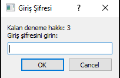
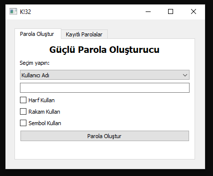
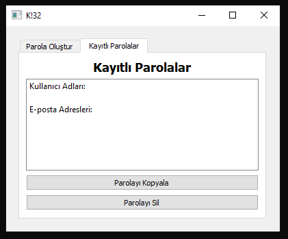

# K!32 Parola Yöneticisi

<div style="display: flex; justify-content: space-between;">
  
  
  
</div>

K!32 Parola Yöneticisi, kullanıcıların güçlü parolalar oluşturmasına, kaydetmesine ve yönetmesine yardımcı olan kullanıcı dostu bir uygulamadır.

## Başlangıç

Bu talimatlar, projeyi yerel makinenizde nasıl çalıştıracağınızı ve geliştirmeye başlayacağınızı açıklar.

### Gereksinimler

Bu projeyi çalıştırmak için aşağıdaki gereksinimlere ihtiyacınız var:

- Python 3.6+
- PyQt5 (GUI bileşeni için)
- SQLite3 (yerel veritabanı için)

### Kurulum

-Dist Klasöründe Hazır bir build bulunmaktadır. .exe'yi çalıştırarak projeye ulaşabilirsiniz.

Proje dosyalarını yerel makinenize klonlayın ve gerekli bağımlılıkları yükleyin:

```bash
git clone https://github.com/MrH4Z3/kl32-password-generator-manager.git
cd kl32-password-generator-manager
python K!32.py
```
-Main Password: cansrc
Uygulama başladığında, güçlü parolalar oluşturabilir, kaydedebilir ve yönetebilirsiniz.

### Katkı
Eğer bu projeye katkıda bulunmak isterseniz, aşağıdaki adımları izleyin:

Bu projeyi fork edin.
Yeni bir branch oluşturun: git checkout -b feature/your-feature
Değişikliklerinizi yapın ve commit edin: git commit -m 'Yeni özellik eklendi'
Branch'ınızı push edin: git push origin feature/your-feature
Bir Pull Request (PR) oluşturun.


### İletişim
📫 Bana [](https://linkedin.com/in/barış-can-sarıca-4836b3242) adresinden ulaşabilirsiniz.
### Kapanış
Projemi incelediğinizi için teşekkür ederim. Herhangi bir eksiğim veya düzeltmem gereken bir yer varsa, istek veya önerilerinizi bana bildirmekten çekinmeyin lütfen. Python öğrenmeye yeni başladığım için hatalarım olabilir.

<div style="background-color: #f5f5f5; text-align: center; padding: 20px;">
  <blockquote style="font-size: 24px; color: #333; font-style: italic;">
    "Hata yapmaktan korkan insan, hiçbir şey yapamaz." - Abraham Lincoln
  </blockquote>
</div>

### ÖNEMLİ
-Kaydettiğiniz parolalar password.db databasesinde şifresiz olarak toplanmaktadır. Programı aktif olarak kullanacaksanız eğer bunu unutmayın. Şifreleriniz çok basit bir şekilde ele geçirilebilir.
-Porgramın deneme amaçlı yazıldığını güvenliksiz olduğunu unutmayın.
-Şifrelerinizi daha güvenli olan programlarda veya not defterlerinizde tutun.
-Bu Program sadece kendimi geliştirmek için ayzdığım bir programdır. Databaseye herhangi bir tuzlama veya ssh ile şifreleme özelliği eklemedim.
